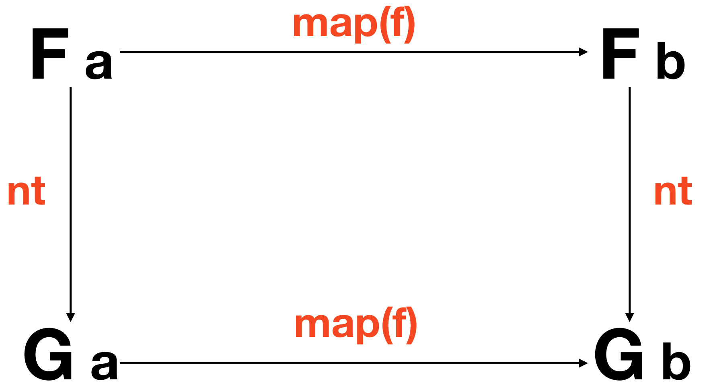

# Глава 11: Опять преобразования, естественно

Нам предстоит обсудить *естественные преобразования* _(natural transformations)_ в контексте практической применимости в повседневном коде. Так получилось, что они являются одной из основ теории категорий и абсолютно необходимы при применении математики для осмысления и рефакторинга кода. Поэтому я считаю своим долгом предупредить вас о печальной несправедливости, свидетелем которой вы, несомненно, окажетесь, поскольку тема будет рассмотрена весьма узко. Приступим.

## Вложенные проблемы

Я хотел бы обсудить тему вложенности (я имею в виду случаи, когда значение окружено двумя или более различными типами).

```js
Right(Maybe('b'));

IO(Task(IO(1000)));

[Identity('bee thousand')];
```

До сих пор нам удавалось избегать подобных ситуаций за счёт того, что все примеры были тщательно продуманы. Но, как видно из кода, на практике типы склонны спутываться, как наушники в кармане. И если мы не будем тщательно содержать типы в порядке, то наш код будет более заросшим, чем битник в кошачьем кафе.

## Ситуационная комедия

```js
// getValue :: Selector -> Task Error (Maybe String)
// postComment :: String -> Task Error Comment
// validate :: String -> Either ValidationError String

// saveComment :: () -> Task Error (Maybe (Either ValidationError (Task Error Comment)))
const saveComment = compose(
  map(map(map(postComment))),
  map(map(validate)),
  getValue('#comment'),
);
```

Мы собрали тут всю банду, к большому разочарованию сигнатуры типов. Позвольте мне кратко объяснить код. Мы начинаем с получения пользовательского ввода с помощью `getValue('#comment')` — это действие, которое возвращает текст в DOM-элементе. Элемент может быть не найден, а также в элементе может отсутствовать текст, поэтому `getValue` вернёт `Task Error (Maybe String)`. После этого мы должны применить `map` к `Task` и к `Maybe`, чтобы направить наш текст в функцию `validate`, которая, в свою очередь, вернёт нам `Either`, содержащий либо `ValidationError`, либо `String`. И затем, когда мы устанем `map`ить, чтобы отправить на сервер нужный `String` из имеющегося `Task Error (Maybe (Either ValidationError String))`, то получим внутри результирующий `Task`.

Какой ужасный беспорядок! Коллаж абстрактных типов, дилетантский экспрессионизм, полиморфный Поллок, монолитный Мондриан. Существуют различные подходы к этой проблеме. Мы можем композировать типы в один чудовищный контейнер, выборочно соединить (`join`) некоторые из них, гомогенизировать, деконструировать и так далее. В этой главе мы сосредоточимся на гомогенизации их с помощью *естественных преобразований*.

## Всё натуральное

*Естественное преобразование* — это «морфизм между функторами», то есть функция, которая оперирует контейнерами. В терминах типов это функция `(Functor f, Functor g) => f a -> g a`. Что делает такую функцию особенной, так это то, что применяя её, мы ни по какой причине не можем взглянуть на содержимое функтора. Это как обмен секретной информацией — ни одна из сторон стороны не знает, что находится в запечатанном манильском конверте с надписью «совершенно секретно». Это структурная операция. Функторная смена костюма. Формально «естественное преобразование» — это любая функция, для которой выполняется следующее условие:



В коде:

```js
// nt :: (Functor f, Functor g) => f a -> g a
compose(map(f), nt) === compose(nt, map(f));
```

И диаграмма, и код говорят об одном и том же: мы можем осуществить естественное преобразование, а затем применить `map`, или же сначала применить `map`, а затем — естественное преобразование, и получить тот же самый результат. Между прочим, это следует из [свободных теорем](ch07-ru.md#бесплатно-как-в-теореме), хотя естественные преобразования (и функторы) не ограничиваются функциями на типах.

## Обоснованные преобразования типов

Как программисты, мы знакомы с преобразованиями типов. Мы, например, можем осуществлять такие преобразования, как `String` в `Boolean` или `Integer` во `Float` (хотя в JavaScript существует только `Number`). Разница здесь только в том, что мы работаем с алгебраическими контейнерами, и в нашем распоряжении есть некоторая теория.

Давайте рассмотрим несколько примеров:

```js
// idToMaybe :: Identity a -> Maybe a
const idToMaybe = x => Maybe.of(x.$value);

// idToIO :: Identity a -> IO a
const idToIO = x => IO.of(x.$value);

// eitherToTask :: Either a b -> Task a b
const eitherToTask = either(Task.rejected, Task.of);

// ioToTask :: IO a -> Task () a
const ioToTask = x => new Task((reject, resolve) => resolve(x.unsafePerform()));

// maybeToTask :: Maybe a -> Task () a
const maybeToTask = x => (x.isNothing ? Task.rejected() : Task.of(x.$value));

// arrayToMaybe :: [a] -> Maybe a
const arrayToMaybe = x => Maybe.of(x[0]);
```

Видите идею? Мы просто меняем один функтор на другой. Мы можем терять информацию по пути, пока сохраняется значение, которое мы `map`им. В этом весь смысл: согласно нашему определению, после преобразования применение `map` всё так же должно производиться.

Мы можем рассматривать это как трансформацию эффектов (это один из способов). С этой точки зрения `ioToTask` будет преобразованием синхронного вычисления в асинхронное, а `arrayToMaybe` — преобразованием из недетерминированного вычисления _(т.е. имеющего множество исходов)_ в вычисление с возможным единственным исходом. Обратите внимание, что мы не сможем преобразовать асинхронное в синхронное в JavaScript; следовательно, не можем написать `taskToIO` — это было бы *сверхъестественным преобразованием*.

## Успокаиваем функциональную зависть

Предположим, мы захотели бы использовать некоторые функции, которые определены для другого типа — как, например, функция `sortBy` для `List`. *Естественные преобразования* обеспечивают отличный способ преобразования в целевой тип, сохраняя корректность `map`.

```js
// arrayToList :: [a] -> List a
const arrayToList = List.of;

const doListyThings = compose(sortBy(h), filter(g), arrayToList, map(f));
const doListyThings_ = compose(sortBy(h), filter(g), map(f), arrayToList); // закон в действии
```

Три раза прикасаемся волшебной палочкой, добавляем `arrayToList` и — вуаля! Наш `[a]` превращён в `List a`, и мы можем применять `sortBy`, когда пожелаем.

Кроме того, становится легче оптимизировать и объединять операции, поместив `map(f)` слева от *естественного преобразования*, как это сделано в `doListyThings_` _(JS в данном примере никакие операции сам не объединит и никакие оптимизации не применит, но такое преобразование поможет тому, кто возьмётся за ручную оптимизацию этого шага — прим. пер.)_.

## Изоморфный JavaScript

Когда мы можем преобразовать нечто, а затем преобразовать обратно и не потерять при этом никакой информации, это считается *изоморфизмом*. Это причудливое название обозначает «содержит те же данные». Мы можем утверждать, что два типа *изоморфны*, если мы можем предоставить *естественные преобразования* `to` _(в)_ and `from` _(из)_ в качестве доказательства этого утверждения.

```js
// promiseToTask :: Promise a b -> Task a b
const promiseToTask = x => new Task((reject, resolve) => x.then(resolve).catch(reject));

// taskToPromise :: Task a b -> Promise a b
const taskToPromise = x => new Promise((resolve, reject) => x.fork(reject, resolve));

const x = Promise.resolve('ring');
taskToPromise(promiseToTask(x)) === x;

const y = Task.of('rabbit');
promiseToTask(taskToPromise(y)) === y;
```

`Promise` и `Task` *изоморфны* _(несмотря на то, что они не равны, так как реализуют различное поведение)_, что и требовалось доказать. Мы также можем написать `listToArray`, чтобы дополнить наш `arrayToList` и показать, что и они тоже изоморфны. А вот `arrayToMaybe` не является *изоморфизмом*, поскольку приводит к потере информации:

```js
// maybeToArray :: Maybe a -> [a]
const maybeToArray = x => (x.isNothing ? [] : [x.$value]);

// arrayToMaybe :: [a] -> Maybe a
const arrayToMaybe = x => Maybe.of(x[0]);

const x = ['elvis costello', 'the attractions'];

// не является изоморфизмом
maybeToArray(arrayToMaybe(x)); // ['elvis costello']

// но является естественным преобразованием
compose(arrayToMaybe, map(replace('elvis', 'lou')))(x); // Just('lou costello')
// ==
compose(map(replace('elvis', 'lou'), arrayToMaybe))(x); // Just('lou costello')
```

Однако `arrayToMaybe` — это самое настоящее *естественное преобразование*, поскольку `map` с обеих сторон от него даёт одинаковый результат. Я упоминаю *изоморфизмы* здесь как бы между делом, пока мы рассматриваем эту тему. Но не стоит их недооценивать — они являются чрезвычайно мощной концепцией и лежат в основе многих других. В любом случае, давайте двигаться дальше.

## Расширяем определение

Структурные функции не ограничиваются преобразованием типов. 

Вот несколько других примеров:

```hs
reverse :: [a] -> [a]

join :: (Monad m) => m (m a) -> m a

head :: [a] -> a

of :: a -> f a
```

Законы для естественных преобразований справедливы и для этих функций тоже. Что может сбить с толку — так это то, что `head :: [a] -> a` можно рассматривать как `head :: [a] -> Identity a`. Мы можем свободно вставлять `Identity` везде, где пожелаем, и законы будут соблюдены, поскольку мы можем доказать, что `a` изоморфно `Identity a`. Видите? Я же говорил, *изоморфизмы* вездесущи!

## История одной вложенности

Вернемся к нашей комедийной сигнатуре типа. Мы можем включить некоторые *естественные преобразования* в клиентский код, чтобы привести каждый вновь появляющийся тип к одному в соответствии с нашими нуждами, сделать их единообразными и, следовательно, соединяемыми (`join`).

```js
// getValue :: Selector -> Task Error (Maybe String)
// postComment :: String -> Task Error Comment
// validate :: String -> Either ValidationError String

// saveComment :: () -> Task Error Comment
const saveComment = compose(
  chain(postComment),
  chain(eitherToTask),
  map(validate),
  chain(maybeToTask),
  getValue('#comment'),
);
```

Итак, что у нас получилось? Мы просто добавили `chain(maybeToTask)` и `chain(eitherToTask)`. Оба имеют одинаковый эффект — они естественным образом преобразуют функтор внутри `Task` в другой `Task`, а затем они соединяются, потому что преобразование применяется в `chain`. Всё, что мы здесь делаем — стремимся не накапливать вложенность. Как говорят в городе света: «Mieux vaut prévenir que guérir» — унция профилактики стоит фунта лечения.

## Итог

*Естественные преобразования* являются функциями, которые оперируют самими функторами. Они являются чрезвычайно важной концепцией в теории категорий и будут появляться всякий раз, когда мы добавляем в работу новые абстракции, а пока мы нашли им несколько конкретных применений. Как мы убедились, мы можем получать различные эффекты, преобразуя типы с гарантией того, что композиция сохранится. Мы можем также преобразовать вложенные типы, хотя в этом случае естественные преобразования осуществляют гомогенизацию наших функторов по наименьшему общему знаменателю. На практике это означает, что для сохранения информации стоит приводить всё к функтору с наиболее разнообразным набором эффектов (в большинстве случаев это `Task`).

Постоянная и утомительная сортировка типов — это цена, которую мы платим за их материализацию — то есть за возможность производить их из воздуха. Конечно, неявные эффекты гораздо более коварны, и поэтому мы здесь боремся за правильное дело. Но нам понадобится ещё несколько инструментов, чтобы накручивать ещё более крупные объединения типов. В следующей главе мы рассмотрим реорганизацию наших типов с помощью *Traversable*.

[Глава 12: Проходя сквозь препятствия](ch12-ru.md)

## Упражнения

### Упражнение A

Напишите естественное преобразование, которое преобразует `Either b a` в` Maybe a`

```js
// eitherToMaybe :: Either b a -> Maybe a
const eitherToMaybe = undefined;
```

### Упражнение B

```js
// eitherToTask :: Either a b -> Task a b
const eitherToTask = either(Task.rejected, Task.of);
```

Используя `eitherToTask`, упростите` findNameById`, чтобы избавиться от вложенного `Either`.

```js
// findNameById :: Number -> Task Error (Either Error User)
const findNameById = compose(map(map(prop('name'))), findUserById);
```

### Упражнение C

Напоминаем, что в упражнении доступны следующие функции:

```hs
split :: String -> String -> [String]
intercalate :: String -> [String] -> String
```

Реализуйте изоморфизм между `String` и `[Char]`.

```js
// strToList :: String -> [Char]
const strToList = undefined;
// listToStr :: [Char] -> String
const listToStr = undefined;
```
