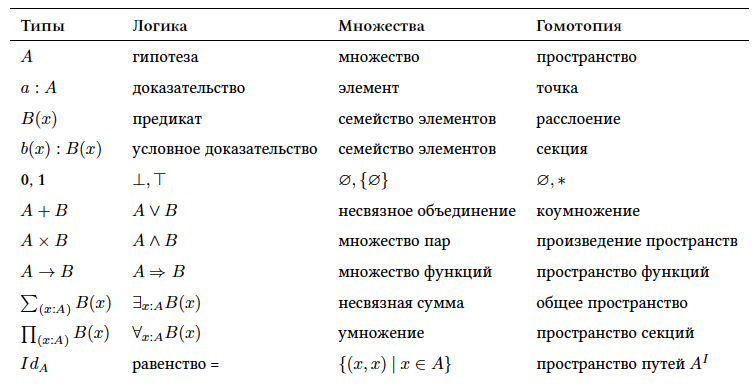

# Пишем код с использованием композиции

## Скрещивание функций

Пример `композиции`:

```js
var compose = function(f,g) {
  return function(x) {
    return f(g(x));
  };
};
```

`f` и `g` — функции, а `x` — значение, которое «пробрасывается» через них.

Композиция напоминает скрещивание функций. Вы, как биолог, выбираете 2 функции с нужными вам характеристиками и скрещиваете их, чтобы получить новый «вид». Вот как можно использовать функцию `compose`:

```js
var toUpperCase = function(x) { return x.toUpperCase(); };
var exclaim = function(x) { return x + '!'; };
var shout = compose(exclaim, toUpperCase);

shout("send in the clowns");
//=> "SEND IN THE CLOWNS!"
```

Композиция двух функций возвращает новую функцию. В этом есть смысл: композиция двух элементов одного типа (в данном случае функций) должна вернуть новый элемент того же типа. Вы же не ждёте, что соединив две части лего у вас получится матрёшка? Композицией управляет закон, с которым мы познакомимся в своё время.

В нашем определении `compose`, функция `g` выполнится перед `f`. Таким образом, данные передаются в функции справа налево. Этот вариант написания функций читается куда лучше, чем несколько вложенных. Без композиции предыдущий код выглядел бы так:

```js
var shout = function(x){
  return exclaim(toUpperCase(x));
};
```

Вместо изнутри наружу, мы читаем код справа налево, что, по-моему, шаг в левом направлении[^ха-ха]. Давайте взглянем на пример, где порядок имеет значение:

```js
var head = function(x) { return x[0]; };
var reverse = reduce(function(acc, x){ return [x].concat(acc); }, []);
var last = compose(head, reverse);

last(['jumpkick', 'roundhouse', 'uppercut']);
//=> 'uppercut'
```

Функция `reverse` перевернёт массив, а `head` — вернёт его первый элемент. Их композиция представляет из себя рабочую, хотя и не эффективную функцию `last`. В данном случае важен порядок функций в композиции. Мы могли бы определить и версию, которая работала бы слева направо, но мы хотим оставаться строгими в отношении математического определения композиции. Так и есть, наша композиция как будто сошла со страниц учебника по математики. Давайте же посмотрим, какие свойства математической композиции мы можем применить.

```js
// ассоциативность
var associative = compose(f, compose(g, h)) == compose(compose(f, g), h);
// true
```

Композиция ассоциативна, это значит, что порядок её применения не важен (в случае вложенной композиции). Если, например, мы хотим заменить все символы в строке на заглавные, то мы можем написать:

```js
compose(toUpperCase, compose(head, reverse));

// или
compose(compose(toUpperCase, head), reverse);
```

Так как порядок группировки функций внутри `compose` не важен, результат будет один и тот же. Это свойство позволяет нам написать `compose` с переменным числом аргументов:

```js
// раньше, нам пришлось бы написать две композиции, но, так как композиция ассоциативна, мы можем передать в `compose` сколько угодно функций и позволить ей решать как сгруппировать их
var lastUpper = compose(toUpperCase, head, reverse);

lastUpper(['jumpkick', 'roundhouse', 'uppercut']);
//=> 'UPPERCUT'


var loudLastUpper = compose(exclaim, toUpperCase, head, reverse)

loudLastUpper(['jumpkick', 'roundhouse', 'uppercut']);
//=> 'UPPERCUT!'
```

Применение свойства ассоциативности обеспечивает гибкость, при эквивалентном результате. В библиотеках вроде [lodash][lodash-website], [underscore][underscore-website], и [ramda][ramda-website] вы найдёте немного более сложное определение композиции функции многих переменных, это нормально.

Одним из приятных аспектов композиции является то, что из любого набора функций можно сделать композицию. Давайте поиграемся с рефакторингом предыдущего примера:

```js
var loudLastUpper = compose(exclaim, toUpperCase, head, reverse);

// или
var last = compose(head, reverse);
var loudLastUpper = compose(exclaim, toUpperCase, last);

// или
var last = compose(head, reverse);
var angry = compose(exclaim, toUpperCase);
var loudLastUpper = compose(angry, last);

// и ещё множество вариантов...
```

Мы просто соединяем части лего так, как мы того хотим, здесь нет какого-либо правильного или не правильного подхода. Обычно, лучше группировать функции так, чтобы их можно было переиспользовать, как `last` и `angry`. Если вы знакомы с Рефаторингом Фаулера «[Refactoring][refactoring-book]», вы можете узнать этот процесс как извлечение метода «[extract method][extract-method-refactor]», за исключением того, что в нашем случае нет состояния объекта, о котором пришлось бы беспокоиться.

## Отсутствие ссылок

Под отсутствием ссылок я подразумеваю стиль написания кода, при котором мы никогда не ссылаемся на данные. Прошу прощения, я имел в виду функции, которые никогда не упоминают данные, над которыми работают. Для написания кода в таком стиле нам пригодятся функции первого класса, каррирование и композиция.

```js
// не в стиле отсутствия ссылок, так как мы упоминаем данные: word
var snakeCase = function (word) {
  return word.toLowerCase().replace(/\s+/ig, '_');
};

// в стиле отсутствия ссылок
var snakeCase = compose(replace(/\s+/ig, '_'), toLowerCase);
```

Заметили, как мы частично применили `replace`? Здесь мы передаём данные от функции к функции, каждая из которых принимает по 1 аргументу. Каррирования позволяет нам подготовить каждую функцию так, чтобы она принимала нужные ей данные, проводила с ними операции и передавала их дальше. Хочу также отметить, что в первом примере нам не нужны данные, чтобы сконструировать нашу функцию, тогда как во втором примере нам требуется `word`, чтобы сделать хоть что-то.

Давайте взглянем на ещё один пример.

```js
// не в стиле отсутствия ссылок, так как мы упоминаем данные: name
var initials = function (name) {
  return name.split(' ').map(compose(toUpperCase, head)).join('. ');
};

// в стиле отсутствия ссылок
var initials = compose(join('. '), map(compose(toUpperCase, head)), split(' '));

initials("hunter stockton thompson");
// 'H. S. T'
```

Код, написанный в стиле отсутствия ссылок, остаётся кратким и общим, а также позволяет избавиться от ненужных имён. Код в таком стиле является лакмусовой бумажкой для функционального кода, позволяющей нам оценить, действительно ли мы пишем небольшие функции, отображающие входные данные на выходные. К примеру, написать цикл `while` с использованием композиции не получится. Однако, имейте в виду, что такой код — это всегда палка о двух концах: иногда он может замаскировать намерения. Не весь функциональный код написан в стиле отсутствия ссылок и это нормально. Мы будем стараться писать так, когда можем, в других случаях будем пользоваться обычными функциями.

## Дебаггинг

Частой ошибкой является попытка использовать композицию с функцией двух аргументов вроде `map`, забыв сперва частично применить её:

```js
// не верно — мы передаём массив в функцию angry и бог знает что в map
var latin = compose(map, angry, reverse);

latin(["frog", "eyes"]);
// ошибка

// правильно — в каждую функцию передаётся по одному аргументу
var latin = compose(map(angry), reverse);

latin(["frog", "eyes"]);
// ["EYES!", "FROG!"])
```

Если у вас возникнут проблемы с отладкой композиций, то вы можете воспользоваться следующей полезной (хотя и не чистой) функцией.

```js
var trace = curry(function(tag, x){
  console.log(tag, x);
  return x;
});

var dasherize = compose(join('-'), toLower, split(' '), replace(/\s{2,}/ig, ' '));

dasherize('The world is a vampire');
// TypeError: Cannot read property 'apply' of undefined
```

Что-то здесь не так, давайте воспользуемся `trace`:

```js
var dasherize = compose(join('-'), toLower, trace("after split"), split(' '), replace(/\s{2,}/ig, ' '));
// after split [ 'The', 'world', 'is', 'a', 'vampire' ]
```

Точно! Нам нужно обернуть `toLower` в `map`, так как мы имеем дело с массивом.

```js
var dasherize = compose(join('-'), map(toLower), split(' '), replace(/\s{2,}/ig, ' '));

dasherize('The world is a vampire');

// 'the-world-is-a-vampire'
```

Функция `trace` позволяет нам в целях отладки вывести данные в консоль. Для упрощения разработки, похожие функции уже реализованы в стандартных библиотеках таких языков как Haskell и Purescript.

Композиция послужит нам хорошим инструментом, и хорошо, что она стоит на фундаменте серьёзной теории, которая гарантирует, что она будет работать. Давайте поговорим об этой теории.

## Теория категорий

Теория категорий — это абстрактный раздел математики, который формализует понятия из других разделов, таких как: теория множеств, теория типов, теория типов, логика и других. В первую очередь в теории категорий рассматриваются объекты, морфизмы и отображения, эти понятия довольно точно дублируются и в программировании. Ниже представлена таблица одинаковых понятий из разных теорий.



Прошу прощения, я не хотел вас испугать. Я не ожидаю того, что вы тщательно разбираетесь в каждой из теорий, представленных выше. Этой иллюстрацией я хотел всего лишь показать, как много понятий дублируются между различными теориями и почему теория категорий стремиться их объединить.

В теории категорий мы оперируем понятием... категории. Категория определяется как коллекция со следующими свойствами:

  * коллекция объектов
  * коллекция морфизмов
  * для пары морфизмов определена композиция
  * для каждого объекта задан тождественный морфизм

Теория категорий достаточно абстрактна, чтобы смоделировать многие вещи, однако давайте применим её к тому, что волнует нас больше всего: к типам и функциям.

**Коллекция объектов**

Объектами будут типы данных, такие как: ``String``, ``Boolean``, ``Number``, ``Object``. Мы часто рассматриваем тип данных как набор возможных значений, например, тип данных ``Boolean`` как множество значений `[true, false]` или ``Number`` как множество всех возможных числовых значений. Такой подход будет как нельзя кстати для применения теории множеств.

**Коллекция морфизмов**

Морфизмами будут наши любимые чистые функции.

**Для пары морфизмов определена композиция**

Как вы могли догадаться, здесь речь пойдёт о новомодной `композиции`. Не случайно мы обсуждали, что наша функция `compose` ассоциативна, так как это свойство любой композиции в теории категорий.

Демонстрация работы композиции:


Пример композиции в коде:

```js
var g = function(x){ return x.length; };
var f = function(x){ return x === 4; };
var isFourLetterWord = compose(f, g);
```

**Для каждого объекта задан тождественный морфизм**
Давайте объявим функцию `id`, которая будет принимать аргумент и просто возвращать его:

```js
var id = function(x){ return x; };
```

Вы можете задать вопрос: «На кой чёрт вообще нужна эта функция?». Мы будем часто пользоваться этой функций в будущих главах, а пока просто воспринимайте её как замену значения — функцию, маскирующуюся под обычные данные.

Функция `id` хорошо сочетается с композицией. Вот вам свойство, которое работает для каждой унарной (от одного аргумента) функции f:

```js
// тождество
compose(id, f) == compose(f, id) == f;
// true
```

Напоминает свойство равенства обычных чисел, не правда ли? Если вам сразу так не показалось — ничего страшного, возьмите небольшую паузу, вы поймёте позже. Скоро мы будем повсюду видеть `id`, но пока что мы видим `id` как функцию-замену значению. Это свойство удобно для написания кода в стиле отсутствия ссылок.

Вот краткое описание теории категорий типов и функций. Если вы познакомились с ней впервые, то, полагаю, вам ещё не до конца ясно что такое категория и чем она может быть полезна, не волнуйтесь, в продолжение этой книги мы копнём глубже. На данный момент, в этой главе, на этой строке, теория категорий по крайней мере подарила нам свойства ассоциативности и тождества.

Какие ещё есть категории? Например, мы можем объявить категорию для направленных графов, где вершины — это объекты, рёбра — морфизмы, а композиция — просто конкатенация пути по графу. Допустим, числа — объекты, а `>=` морфизмы[^вообще, любая дробная или целая степень может быть категорией]. Категорий на самом деле целая куча, но для целей этой книги нас будут интересовать только определённая выше категория. Для начала мы узнали достаточно и можем двигаться дальше.

## Итог

Композиция соединяет наши функции вместе как набор труб, данные «протекают» через наше приложение так как должны — чистые функции отображают входные данные на значения, поэтому разрыв в этой цепи вызовет потерю выходного значения и всё наше приложение станет бесполезным.

Принцип композиции является важнейшим среди прочих, так как помогает сохранять наше приложение простым и логичным. Теория категорий сыграет главную роль в архитектуре приложения, моделировании побочных эффектов и безошибочности работы приложения.

Самое время опробовать наши знания на практике, давайте напишем приложение.

[Часть 6: Пример приложения](ch6-ru.md)

## Упражнения

```js
var _ = require('ramda');
var accounting = require('accounting');
  
// Тестовые данные
var CARS = [
    {name: "Ferrari FF", horsepower: 660, dollar_value: 700000, in_stock: true},
    {name: "Spyker C12 Zagato", horsepower: 650, dollar_value: 648000, in_stock: false},
    {name: "Jaguar XKR-S", horsepower: 550, dollar_value: 132000, in_stock: false},
    {name: "Audi R8", horsepower: 525, dollar_value: 114200, in_stock: false},
    {name: "Aston Martin One-77", horsepower: 750, dollar_value: 1850000, in_stock: true},
    {name: "Pagani Huayra", horsepower: 700, dollar_value: 1300000, in_stock: false}
  ];

// Упражнение 1:
// ============
// используйте _.compose() для того чтобы переписать функцию снизу. Подсказка: _.prop() каррируемая.
var isLastInStock = function(cars) {
  var last_car = _.last(cars);
  return _.prop('in_stock', last_car);
};

// Упражнение 2:
// ============
// используйте _.compose(), _.prop() and _.head() чтобы получить название первой машины
var nameOfFirstCar = undefined;


// Упражнение 3:
// ============
// используйте функцию _average для того чтобы отрефакторить averageDollarValue с помощью композиции
var _average = function(xs) { return _.reduce(_.add, 0, xs) / xs.length; }; // <- оставьте эту функцию

var averageDollarValue = function(cars) {
  var dollar_values = _.map(function(c) { return c.dollar_value; }, cars);
  return _average(dollar_values);
};


// Упражнение 4:
// ============
// Напишите функцию: sanitizeNames() использую композицию которая возвращает список имён в нижнем регистре и заменяя все пробелы на _, пример: sanitizeNames(["Hello World"]) //=> ["hello_world"].

var _underscore = _.replace(/\W+/g, '_'); //<-- не изменяйте эту функцию

var sanitizeNames = undefined;


// Бонус 1:
// ============
// Отрефакторьте availablePrices с помощью композиции.

var availablePrices = function(cars) {
  var available_cars = _.filter(_.prop('in_stock'), cars);
  return available_cars.map(function(x){
    return accounting.formatMoney(x.dollar_value);
  }).join(', ');
};


// Бонус 2:
// ============
// Отрефакторьте в стиле отсутствия ссылок. Подсказка: вы можете использовать _.flip()

var fastestCar = function(cars) {
  var sorted = _.sortBy(function(car){ return car.horsepower }, cars);
  var fastest = _.last(sorted);
  return fastest.name + ' is the fastest';
};
```

[lodash-website]: https://lodash.com/
[underscore-website]: http://underscorejs.org/
[ramda-website]: http://ramdajs.com/
[refactoring-book]: http://martinfowler.com/books/refactoring.html
[extract-method-refactor]: http://refactoring.com/catalog/extractMethod.html
